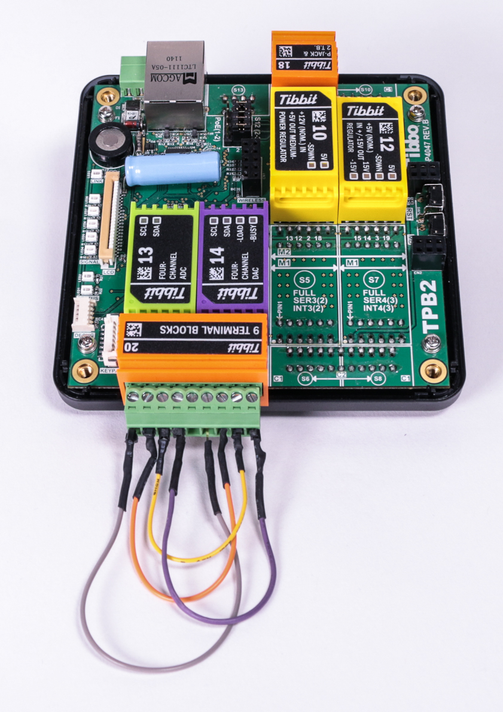
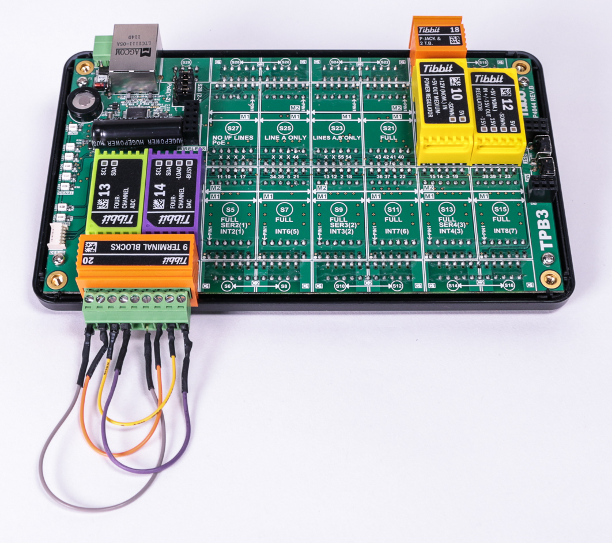

# Test Application for the ADC (#13) and DAC (#14) Tibbits

Both Tibbits are tested in the same project. The ADC outputs preset voltages and DAC measures them.

You will need:

- TPP2, TPP2(G2), TPP3, or TPP3(G2) board
- One Tibbit #12 (+/-15V power supply)
- One Tibbit #13 (4-channel ADC)
- One Tibbit #14 (4-channel DAC)
- One Tibbit #20 (9 terminal blocks)
- Optionally, one Tibbit #9 or #10 (12V->5V regulator)
- Optionally, one Tibbit #18 (power jack)

*The last two Tibbits are necessary if you are going to power your rig from a 12V power adaptor. Alternatively you can supply regulated +5V power directly to the TPP.*

Pictures below illustrate the test arrangement. Notice the wires on the terminal block Tibbit. They interconnect ADC and DAC channels.

On boot, DAC channels will be set to -9.50V, -5.00V, +1.25V, and +7.00V. The program will then print the values measured by ADC channels. Printing is done with sys.debugprint. Therefore, you must run this program in the debug mode.

 

